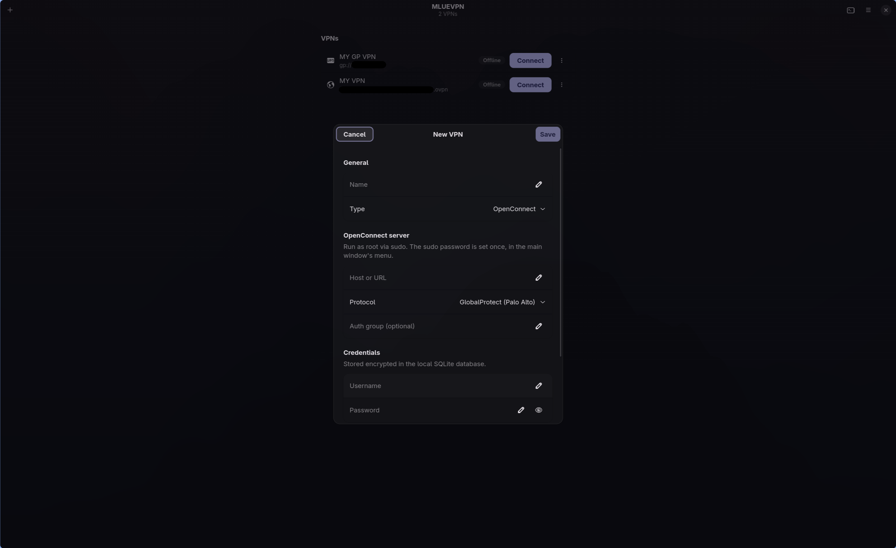
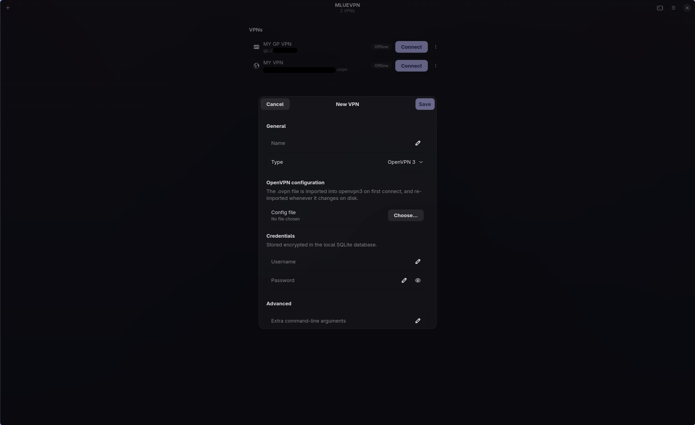

# MLUEVPN

GTK4 VPN manager for **OpenConnect** (GlobalProtect) and **OpenVPN 3**.
Credentials are stored encrypted, so connecting is one click.

## Features

Every VPN in one list, with live status and one-click connect. **Ctrl+L** opens
the connection log.



Or point at an **`.ovpn` file** for OpenVPN 3. It's imported on first connect
and re-imported whenever it changes on disk. No sudo needed.



Credentials in both flows are encrypted in a local SQLite database, with the key
held in your system keyring.

## Install

```bash
sudo pacman -S --needed git uv base-devel \
  python-gobject gtk4 libadwaita openconnect sudo

git clone https://github.com/mlue/mluevpn.git
cd mluevpn
uv run poe install
```

For `.ovpn` profiles you also need `openvpn3`, which is AUR-only:

```bash
yay -S openvpn3-git
```

## Develop

```bash
uv venv --python /usr/bin/python3 --system-site-packages
uv sync
uv run poe app
```

Both `uv venv` flags are required — without them the app can't see the system
`gi` module. Quit any installed copy first; GTK's single-instance rule means a
second launch just raises the running window.

| Task | Does |
| --- | --- |
| `uv run poe app` | Run from source |
| `uv run poe build` | Build the pacman package |
| `uv run poe install` | Build **and** install it |
| `uv run poe wheel` | Python wheel into `dist/` |
| `uv run poe clean` | Delete build artefacts |

## Share it

The result is an ordinary Arch package — the recipient needs no Python, no
`uv`, and not this repo.

```bash
uv run poe build
scp packaging/mluevpn-0.1.1-1-any.pkg.tar.zst them@their-box:~/
```

Then on their machine:

```bash
sudo pacman -U ~/mluevpn-0.1.1-1-any.pkg.tar.zst
```

Use the real filename that `poe build` prints, not a `mluevpn-*` glob — a
wildcard also matches older builds still in `packaging/`.

## Release

Bump `version` in `pyproject.toml`. That is the only place it lives: the build
syncs `pkgver` in the PKGBUILD, and the app reads its own version from the
installed metadata.

```bash
uv run poe clean
uv run poe install
pacman -Q mluevpn
```

Close and reopen the app afterwards — a running copy keeps the old code.

That covers a local install. To publish a release to GitHub and the AUR, follow
[docs/releasing.md](docs/releasing.md) — the order of the tag, `updpkgsums` and
`.SRCINFO` steps matters.

## Troubleshooting

- **`ModuleNotFoundError: gi`** — the venv was made without the two flags.
  Delete `.venv` and redo it.
- **`poe app` exits instantly** — an installed copy is already running.
  `pkill -f /usr/bin/mluevpn` first.
- **Never build with sudo.** makepkg refuses to run as root; only installing
  needs elevation.
- **OpenVPN says "New tunnel did not respond"** — an Arch library upgrade
  outran the AUR build. Check with
  `ldd /usr/lib/openvpn3-linux/openvpn3-service-client | grep 'not found'`,
  then `yay -S --rebuildall openvpn3-git`.
- **Never share** `mluevpn.db`, `master.key`, or your `.ovpn` files.

## In the app

**+** adds a VPN · **Ctrl+L** shows the log · **System check…** reports whether
openconnect/openvpn3 are installed or need updating.

Data lives in `~/.local/share/mluevpn/` (0600); the encryption key is in your
keyring.

---

Design notes: **[docs/design.md](docs/design.md)** · Licence: [MIT](LICENSE)
